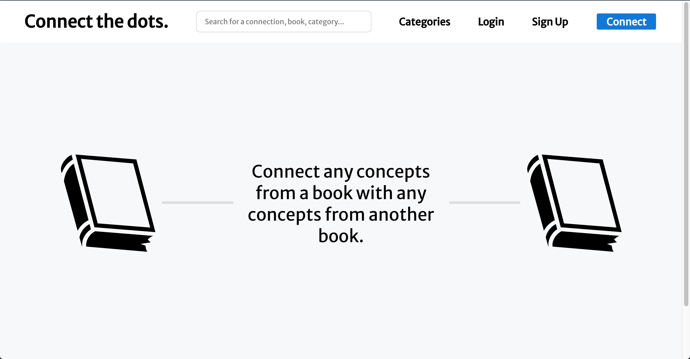

# Connect the dots

This website is a tool that allows people to connect concepts of a book to any concepts of any other book. By creating this project, my will was to facilitate the process of joining ideas together when reading books.

### Link:

## Technologies used

#### Front-End

- React
- Redux
- React-Quill
- Styled-Components

#### Back-End

- Node.JS
- Express

#### Database

- MongoDB

## Video Demo

## Demo snippets

### Home Page

### User Authentification

### View all categories and single categories. Bookmark the category. (An unknow category will be dynamically added to the list)

### View book information and boomark it

### Connection (Free option)

### Connection (Structure option)

### View and Bookmark Connection

### Search for a connection

